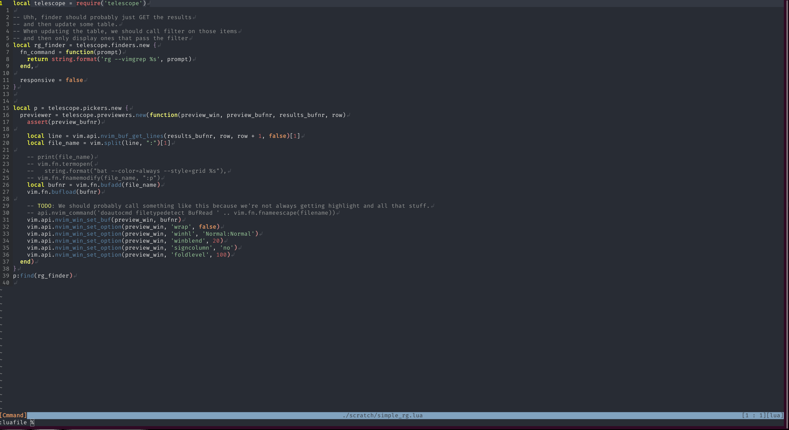

# telescope.nvim

Gaze deeply into unknown regions using the power of the moon.



## Installation

```vim
Plug 'nvim-lua/plenary.nvim'
Plug 'nvim-lua/telescope.nvim'
```

## Goals


### Pipeline Different Objects

(Please note, this section is still in progress)

"finder":
- executable: rg, git ls-files, ...
- things in lua already
- vim things

"picker":
- fzf
- sk
- does this always need to be fuzzy?
    - you'll map what you want to do with vimscript / lua mappings

"previewer":
- sometimes built-in
- sometimes a lua callback


As an example, you could pipe your inputs into fzf, and then it can sort them for you.

fzf:
- have a list of inputs
- i have a prompt/things people typed
- instantly return the stuff via stdout
